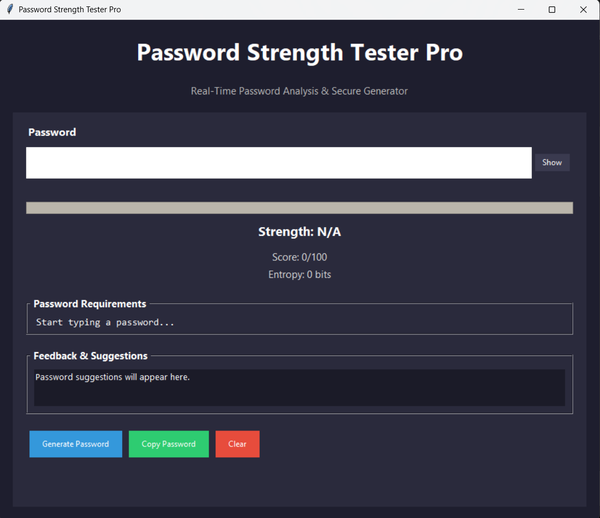
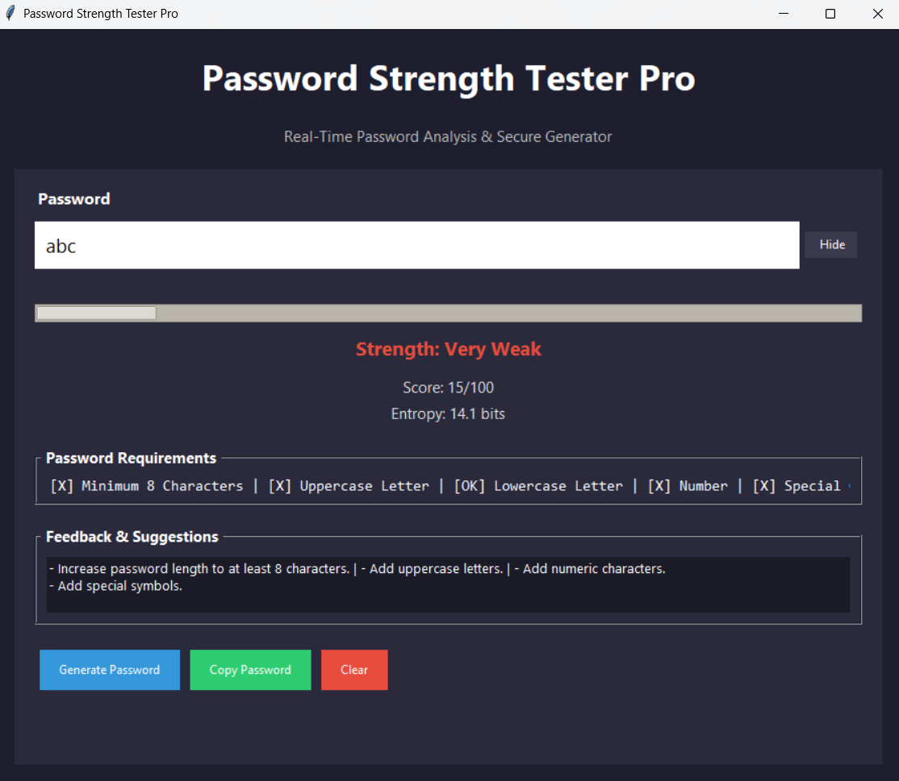
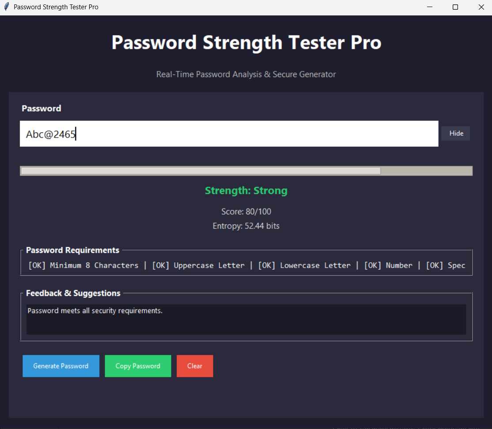
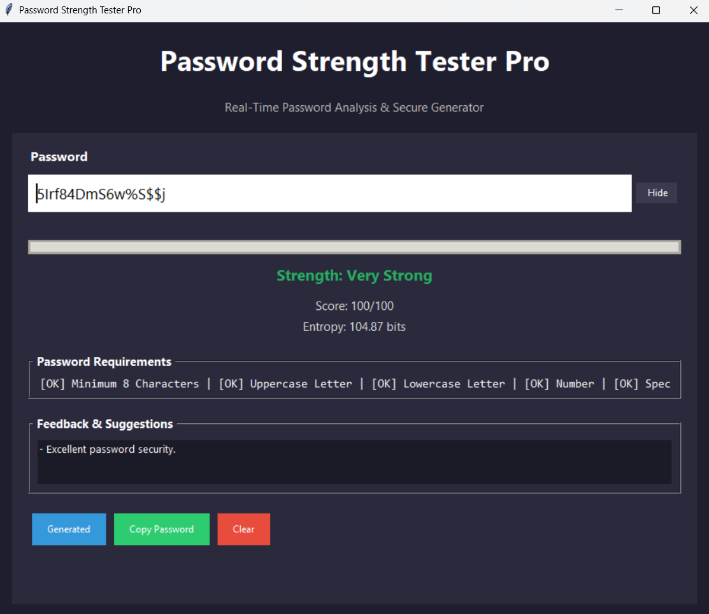

# 🔐 Password Strength Tester Pro

## 📖 Description
This is a Python-based desktop application that analyzes password strength in real time and helps users create more secure passwords.

The application evaluates password complexity, calculates entropy, validates security requirements, and provides suggestions for improving password security. It also includes a secure password generator and clipboard copy functionality.

This project was developed as part of a cybersecurity internship project.

---

## 🚀 Features
- Real-Time Password Strength Analysis
- Password Strength Scoring (0–100)
- Password Entropy Calculation
- Password Requirements Validation
- Secure Password Generator
- Show / Hide Password Functionality
- Clipboard Copy Support
- Dynamic Feedback & Suggestions
- Dark-Themed GUI Interface
- Error Handling & Input Validation

---

## 🛠️ Technologies Used
- Python
- Tkinter
- Pyperclip
- Secrets Module
- Regular Expressions (Regex)

---

## ▶️ How to Run

1. Install dependency

pip install pyperclip

2. Run program

python password_strength_tester.py

---

## 🧪 Example Usage

Password: abc

Strength: Very Weak

Score: 15/100

Entropy: 14.1 bits

Password: Abc@2465

Strength: Strong

Score: 80/100

Entropy: 52.44 bits

Password: 5Irf84DmS6w%S$$j

Strength: Very Strong

Score: 100/100

Entropy: 104.87 bits

---

## 📁 Project Structure

Password_Strength_Tester_Pro/

├── password_strength_tester.py
├── README.md
├── requirements.txt
├── Password_Strength_Tester_Pro_Report.pdf
├── screenshots/
│   ├── 01_Home_Screen.png
│   ├── 02_Very_Weak_Password.png
│   ├── 03_Strong_Password.png
│   └── 04_Very_Strong_Generated.png

---

## 📸 Screenshots

### 🔹 Home Screen

### 🔹 Very Weak Password Analysis

### 🔹 Strong Password Analysis

### 🔹 Very Strong Generated Password

---

## 📌 Applications
- Password Security Assessment
- Cybersecurity Awareness & Education
- Secure Account Creation
- Password Policy Validation
- Personal Security Improvement
- Learning Password Security Concepts

---

## ⚠️ Disclaimer
This project is developed for educational and cybersecurity learning purposes only.

---

## 👨‍💻 Author
Samyak Bhaisare